Self-taught Systems & DevOps Engineer with hands-on experience in GitOps, Docker/Linux infrastructure, Proxmox clustering, Python automation, and hardware-level infrastructure.

---

  <picture>
    <source
      srcset="./profile/stats.svg"
    />
    
  </picture>
  
  <picture>
    <source
      srcset="./profile/top-langs.svg"
    />
    
  </picture>

---
